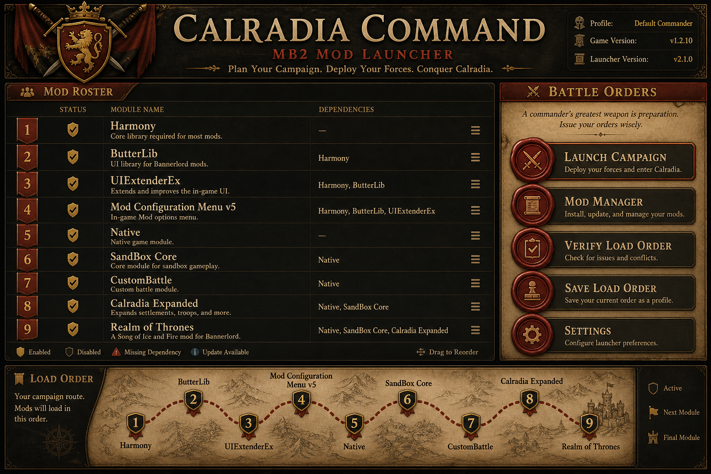

# MB2 Mod Launcher

A native Linux mod manager for **Mount & Blade II: Bannerlord**, built for Steam + Proton setups on Arch and other distros. Manage your mod list, load order, and `LauncherData.xml` without wrestling with the Windows launcher under Wine.



## Features

- **Automatic game detection** — Finds Bannerlord across multiple Steam library folders (`libraryfolders.vdf`)
- **Workshop mod support** — Scans `steamapps/workshop/content/261550/` on every Steam drive, including nested Workshop layouts
- **Load order management** — Enable/disable mods, drag-and-drop reordering, and save to `LauncherData.xml`
- **Auto sort** — Topological sort from `SubModule.xml` dependencies, with pins for Harmony, ButterLib, and other framework mods
- **DLL unblocking** — Clears the Proton/Wine `user.proton` xattr on mod DLLs so they load correctly
- **Proton path discovery** — Locates `LauncherData.xml` inside the game's Proton prefix

## Requirements

- Linux (tested on CachyOS / Arch)
- [Rust](https://rustup.rs/) (2021 edition)
- [Node.js](https://nodejs.org/) 18+
- Steam with Bannerlord installed (Proton recommended)
- System dependencies for [Tauri 2 on Linux](https://v2.tauri.app/start/prerequisites/) (e.g. `webkit2gtk`, `libayatana-appindicator` or equivalent)

## Install & run

```bash
git clone https://github.com/SamiulH25/mb2-mod-launcher.git
cd mb2-mod-launcher
npm install
npm run tauri:dev
```

### Release build

```bash
npm run tauri:build
```

The binary and bundle land in `src-tauri/target/release/`.

## Usage

1. Launch the app and click **Detect Game** to scan your Steam install.
2. Review the mod roster — badges show whether each mod came from the **Game** `Modules/` folder or **Workshop**.
3. Toggle mods on/off and drag rows to set load order.
4. Use **Auto Sort** to order enabled mods by their declared dependencies.
5. Click **Unblock DLLs** if Proton is blocking mod native libraries.
6. **Save Load Order** writes your configuration to `LauncherData.xml` in the Proton prefix.

If auto-detection fails (e.g. game on an external drive), set the game path manually to your Bannerlord install root:

```
.../steamapps/common/Mount & Blade II Bannerlord
```

## How Workshop scanning works

Workshop content lives under numbered folders:

```
steamapps/workshop/content/261550/<workshop_id>/
```

The scanner searches each workshop item recursively for `SubModule.xml`, handling common layouts:

- `SubModule.xml` at the workshop item root
- `ModName/SubModule.xml` (nested folder)
- `Modules/ModName/SubModule.xml`

Mods found in both `Modules/` and Workshop are deduplicated by module ID; the game install takes priority.

## Project structure

```
├── crates/mb2-core/     # Rust library: paths, scanner, load order, LauncherData I/O
├── src-tauri/           # Tauri 2 backend and IPC commands
└── src/                 # Svelte 5 frontend
```

| Crate / module | Responsibility |
|---|---|
| `paths` | Steam library discovery, game/workshop/Proton paths |
| `scanner` | Module detection from `Modules/` and Workshop |
| `submodule` | `SubModule.xml` parser |
| `load_order` | Dependency-aware topological sort |
| `launcher_data` | Read/write `LauncherData.xml` |
| `dll` | Linux xattr unblock for mod DLLs |

## Roadmap

- [ ] Launch Bannerlord directly via Proton
- [ ] Nexus Mods metadata search integration
- [ ] Loadout profiles and preset import (`.bmlist`, etc.)
- [ ] Manual game path UI in settings

## License

MIT
